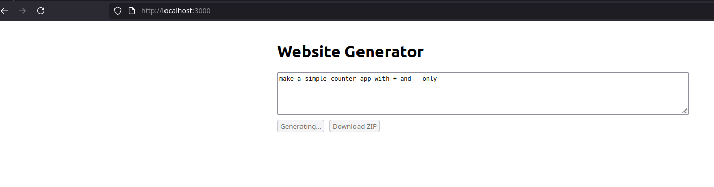
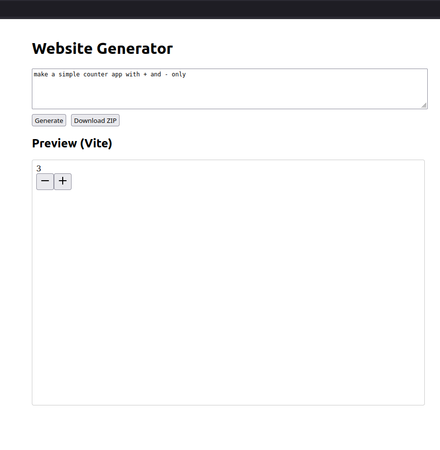
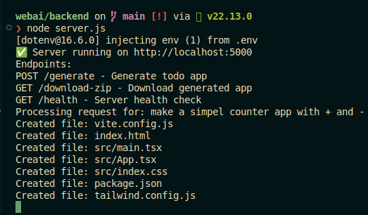

# AI Website Generator

This is a full-stack AI-powered web application that generates **React + Vite websites** based on natural language prompts using **Google Gemini AI**.  

It sets up the generated code, installs dependencies, starts a live preview server (via Vite), and lets you download the code as a ZIP file.

---

## ✨ Features

✅ **Generate React + Vite websites** using Gemini AI  
✅ **Automatic dependency installation** (`npm install`)  
✅ **Live preview server** with Vite (port 5173)  
✅ **Download generated code as ZIP**  
✅ **Fallback preview using Express static server** if Vite fails  
✅ **Simple frontend to submit prompt + view preview**  

---

## 🚀 Tech Stack

| Layer       | Tech |
|-------------|-----------------------------|
| Frontend    | React, TypeScript, Axios |
| Backend     | Node.js, Express |
| AI Service  | Google Gemini API |
| Build Tools | Vite |
| Utilities   | fs-extra, archiver, child_process (for `exec`) |

---

## 🏗️ Architecture

## Frontend (React app: 3000)
    |
    └── POST /generate
       

## Backend (Express: 5000)
    |
    ├── Calls Gemini API -> Generates code files  
    |  
    ├── Writes files to generated-site/  
    |  
    ├── Runs npm install in generated-site/  
    |  
    ├── Starts Vite server (5173)  
    |  
    └── Serves ZIP / fallback preview if needed  
      

**Flow:**  
1️⃣ User submits prompt in React app  
2️⃣ React calls `/generate` API on Express backend  
3️⃣ Backend sends prompt to Gemini → receives code  
4️⃣ Files are written → dependencies installed → Vite started  
5️⃣ React app polls Vite and shows the live preview  
6️⃣ Optionally, user downloads the ZIP 
  
  
  
